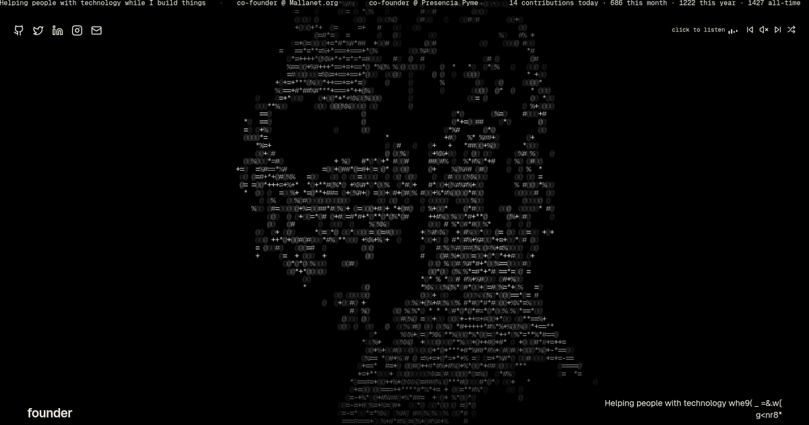

# jseramn.tech

Personal portfolio for **José Ramón García Del Risco** ([jseramn](https://github.com/jseramn)) — Vesper terminal aesthetic, encrypted contact, and live GitHub presence.

**Live:** [jseramn.tech](https://jseramn.tech) · **LLM summary:** [/llms.txt](https://jseramn.tech/llms.txt)



## Stack

| Layer | Tech |
|-------|------|
| Site | [Astro 5](https://astro.build) (static + serverless API on Vercel) |
| UI | [React 19](https://react.dev) islands, [Tailwind CSS](https://tailwindcss.com), [Motion](https://motion.dev) |
| ASCII | WebGL2 (no Three) |
| Email | [Resend](https://resend.com) (`POST /api/contact`) |
| Crypto | [age](https://github.com/FiloSottile/age) / [typage](https://github.com/FiloSottile/typage) in the browser |

## Features

- Fullscreen ASCII portrait via **WebGL2** (no Three; black until glyphs paint)
- Rotating roles, marquee (orgs + GitHub commit ticker), YouTube ambient audio
- Public Tinity page at `/tinity`
- **Encrypted contact modal** — ciphertext to `contacto@jseramn.tech`; decryption key via X / Instagram DM
- SEO: Open Graph, Twitter Cards, JSON-LD, sitemap, `robots.txt`
- Security headers (CSP, HSTS), optional Turnstile + Upstash rate limits on the contact API

## Getting started

```bash
pnpm install
cp .env.example .env   # local only — never commit .env
pnpm dev
pnpm check
pnpm test:e2e
pnpm format
pnpm tinity:pull          # refresh src/tinity from jseramn/tinity main
# TINITY_SRC=/path/to/tinity TINITY_REF=branch pnpm tinity:pull
```

Production build:

```bash
pnpm build
```

`pnpm preview` does **not** work with the Vercel adapter. Use `pnpm dev` locally for runtime checks.

Deploy target: **Vercel** (`@astrojs/vercel`). Set environment variables in the Vercel dashboard (see below).

## Project structure

```
src/
  config/site.ts          # Identity, SEO, socials, contact email, crypto links
  components/
    Hero.tsx              # Split island (~82 LOC); not a 500-line monolith
    ContactModal.tsx      # age encrypt + API send (~260 LOC)
    contact/              # Form, success, fallback views
    TurnstileField.tsx    # Optional bot check
    TextLoop.tsx, InfiniteSlider.tsx
  tinity/                 # Vendored Tinity landing (`pnpm tinity:pull`)
  lib/
    contactEncrypt.ts     # Client-side age passphrase encryption
    contactEmail.ts       # Payload validation + email body
    security/             # CSP, origin check, rate limit, Turnstile verify
  middleware.ts           # Security headers on all responses
  pages/
    index.astro
    tinity/               # `/tinity`
    api/contact.ts        # Resend relay (ciphertext only)
public/
  llms.txt                # Machine-readable site & profile summary
  videobg-480.webm, videobg-480.mp4  # ASCII sampler 426×240
  thumbnail.png, favicons, site.webmanifest
vercel.json               # Security headers on static assets + API cache / noindex
scripts/sync-vercel-security-headers.mjs  # Regenerates vercel.json header block at build
scripts/tinity-pull.mjs                   # Vendors jseramn/tinity landing into src/tinity
scripts/generate-preview-assets.sh        # Regenerates OG/favicon set from a 1920×1080 snapshot
```

Canonical copy and links for humans and SEO live in `src/config/site.ts`.

## Environment variables

Copy `.env.example` to `.env` for local API testing.

| Variable | Required | Purpose |
|----------|----------|---------|
| `RESEND_API_KEY` | Production | Send encrypted contact mail |
| `PUBLIC_TURNSTILE_SITE_KEY` | Recommended | Turnstile widget (client) |
| `TURNSTILE_SECRET_KEY` | Recommended | Turnstile verify (server) |
| `UPSTASH_REDIS_REST_URL` | Optional | Rate limit storage |
| `UPSTASH_REDIS_REST_TOKEN` | Optional | Rate limit storage |

Domain `jseramn.tech` must stay verified in Resend for the `from` address in `site.ts`.

## Security

### Contact form threat model

- Plaintext **never** leaves the visitor’s browser; only age armored ciphertext is emailed.
- **Decryption keys** are shown only to the visitor and must be sent via social DM (out of band).
- Server secrets live only in Vercel env vars, not in git.

### Controls

| Control | Location |
|---------|----------|
| CSP, HSTS, COOP, CORP, frame deny | `vercel.json` (static CDN) + `src/middleware.ts` (API/middleware path) |
| API `no-store` / noindex | `vercel.json` |
| Same-origin `POST /api/contact` | `src/lib/security/contactApi.ts` |
| Honeypot | `ContactModal.tsx` |
| Turnstile (when env set) | `TurnstileField.tsx`, contact API |
| 8 req/h/IP (when Upstash set) | `@upstash/ratelimit` |
| Payload size cap (~600 KB) | contact API |
| Generic API errors | `src/pages/api/contact.ts` |

### Production checklist

1. Set `RESEND_API_KEY` on Vercel.
2. Configure Turnstile for `jseramn.tech` (`PUBLIC_*` + `TURNSTILE_SECRET_KEY`).
3. (Recommended) Upstash Redis for distributed rate limiting.
4. Enable GitHub secret scanning; never commit `.env` or scratch files with keys.
5. Review Resend bounces / suppressions periodically.

### HTTP headers (static on Vercel)

Astro middleware only runs on server-rendered paths. Static HTML and `/_astro/*` are served from the Vercel CDN **without** middleware, so production security headers are applied via `vercel.json`. The policy lives in `src/lib/security/siteSecurityHeaders.mjs` and is synced into `vercel.json` on every `pnpm build`. On those server-rendered paths the middleware runs inside the Node serverless function, not a separate Edge hop, so `POST` method and body reach `/api/*` handlers.

### DNS / email (operator — not in this repo)

| Item | Action |
|------|--------|
| DKIM | Configure in GoDaddy / Secureserver |
| DMARC | Move `p=quarantine` → `p=reject` after DKIM works |
| DNSSEC | Enable in GoDaddy |
| CAA | e.g. `0 issue "letsencrypt.org"` |
| MTA-STS | Publish policy when ready |
| HSTS preload | Submit at [hstspreload.org](https://hstspreload.org) after deploy |

The repo is **public by design**. Security does not rely on hiding client-side encryption; protect **secrets** and **per-message passphrases**.

### Decrypting inbound mail (operator)

Save the armored block from email, then locally:

```bash
age -d -o mensaje.json encrypted.age
# Enter the passphrase from the visitor’s social DM when prompted
```

## Credits

This portfolio is a derivative of [rubenmarcus/portfolio](https://github.com/rubenmarcus/portfolio) by [Ruben Marcus](https://github.com/rubenmarcus) ([rubenmarcus.dev](https://rubenmarcus.dev)), used under the MIT License. Substantial portions of structure, patterns, and aesthetic direction originate there; identity, content, contact encryption, and site-specific features are original to jseramn.tech.

## License

[MIT](./LICENSE) — Copyright (c) 2026 Ruben Marcus; Copyright (c) 2026 José Ramón García Del Risco.
